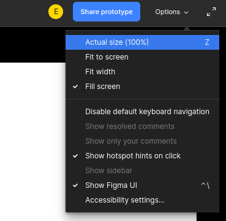

Инструкции для MarkDown
## Выделения текста
*1. Что бы текст был курсивом необходимо обрамить текст звездочками или знаком нижнее подчеркивание("_")*

**2. Что бы текст был курсивом необходимо обрамить текст полужирным или двумя знаками нижнее подчеркивание ("__")**

Зачем нужны альтернативные выделения, для того чтоб совмещать эти выделения. *__текст может быть одновременно полужирным и курсивом__*  

Что бы текст был с 
новой строки поставь два 

пробела
***
**Списки используйте звездочку  (Звездочка + пробел) или знаком + **

* Элемент 1
* Элемент 2
* Элемент 3
+ Элемент 4

*Нумированные списки (цифра + точка + пробел)*

1. Элемент 1
2. Элемент 2

## Первый заголовок (## + пробел перед заголовком)
### Второй заголовок (### + пробел перед заголовком)
#### Третий заголовок (#### + пробел перед заголовком)
##### Четвертый заголовок (##### + пробел перед заголовком)

Что бы вставить изображение в текст необходимо прописать эти знаки __!__**[*комент к фото*]**__(путь к фотот)__

### пример:
